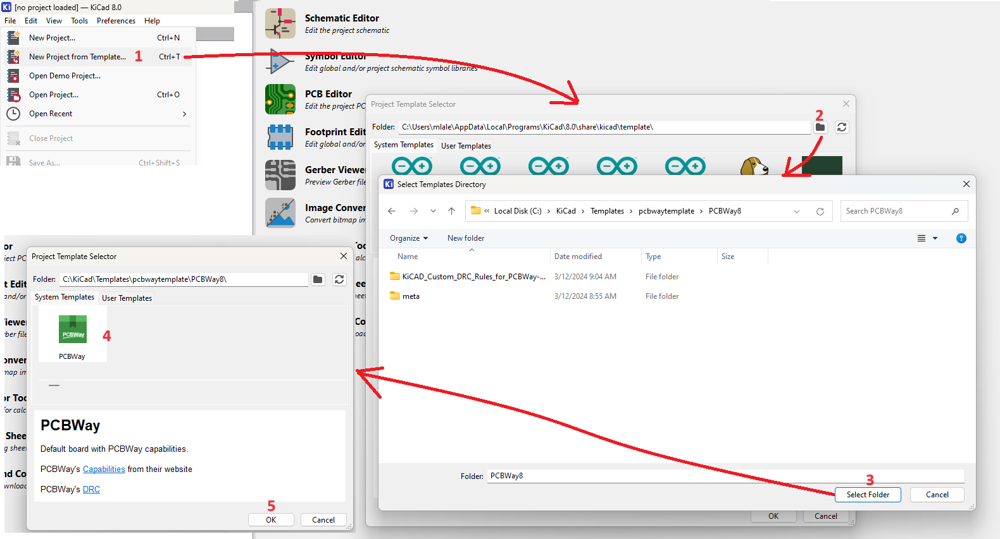

# Barbarach BC - PCBWay Template
My template based on [PCBWay capabilities](https://www.pcbway.com/capabilities.html) and their [DRC template](https://www.pcbway.com/pcb_prototype/PCB_Design_Rule_Check.html).
I only added my logo and metadata so it appears as a template. This template is for KiCad 8.0

I'll keep this up to date how I like working with KiCad. In order to use it, download this repo, extract it somewhere and just follow these easy steps:
1. Open KiCad and select File/New Project from Template... menu option
2. Navigate to the folder where you extracted the files
3. Select the Folder
4. In the list, all templates in the folder will appear. Well, I have only 1 there :)
5. Press OK and then all you need is decide where you want to create your new project. Easy!

Alternatively (and I used this before) [this set of templates](https://github.com/sethhillbrand/kicad_templates) looks good.